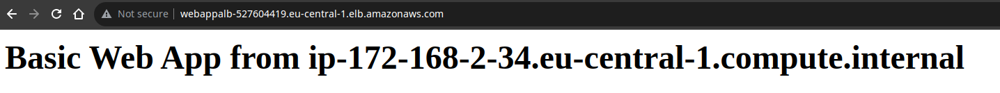

# Terraform AWS ALB Example

This example deploys a set of EC2 instances behind an ALB for AWS provider.

----------------

### Requirements

[Terraform](https://developer.hashicorp.com/terraform/tutorials/aws-get-started/install-cli)<br />
[AWS Credentials](https://docs.aws.amazon.com/cli/latest/userguide/cli-configure-files.html)

### Getting Started

```bash
terraform init                   # Initilaze the working directory
terraform plan                   # Preview any changes before you apply
terraform apply --auto-approve   # Executes the changes defined by main.tf
```

:arrow_forward: After apply command, go to Load Balancers from console and copy the DNS Name. Refresh the page 5-10 times. As a result, you will see 3 different web-app instances are running in 2 different subnets.




### Destroy Infrastructure

`terraform destroy`


